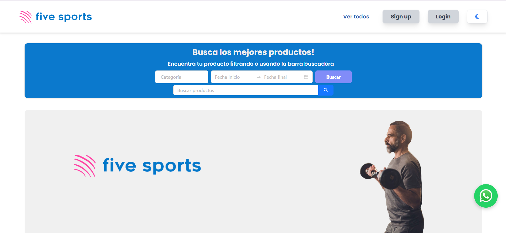
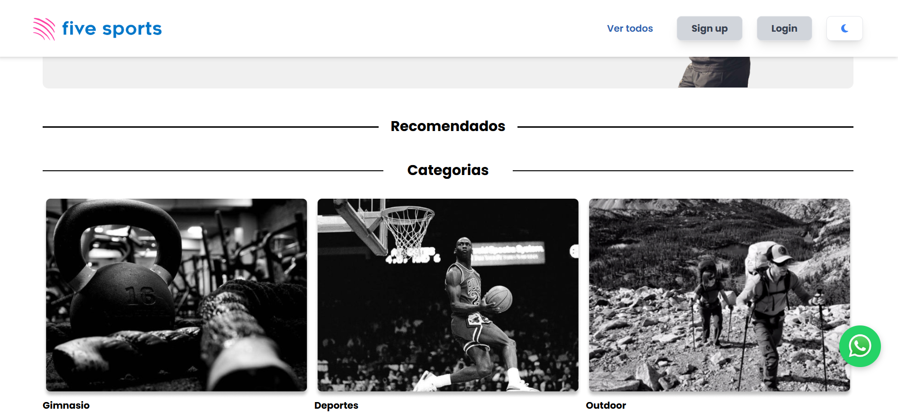
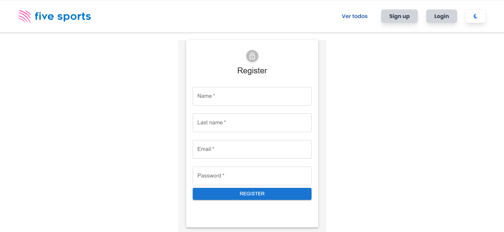

# SportHub Reservation System

> A full-stack web application for managing sports equipment reservations with real-time availability tracking and user authentication.

[](https://reactjs.org/)
[](https://firebase.google.com/)
[](https://vitejs.dev/)

---

## 📸 Screenshots

<div align="center">
  
  <p><em>Home Page - Search and filter sports equipment</em></p>
  
  
  <p><em>Product categories</em></p>
  
  
  <p><em>Register</em></p>
</div>

---

## 🎯 Problem Statement

Sports facilities and equipment rental businesses struggle with:
- Manual booking processes leading to double bookings
- Lack of real-time availability visibility
- Inefficient resource management
- Poor user experience in the reservation process

**SportHub** solves these problems by providing an automated, user-friendly platform that handles equipment reservations with intelligent date conflict detection and real-time inventory management.

---

## ✨ Key Features

### Core Functionality
- **Smart Reservation System**: Date-based availability checking with conflict prevention
- **User Authentication**: Secure Firebase authentication with protected routes
- **Product Catalog**: Categorized sports equipment (Gym, Sports, Outdoor)
- **Advanced Search & Filtering**: 
  - Search by product name
  - Filter by category
  - Filter by date availability
- **Interactive Calendar**: Visual date selection with blocked unavailable dates
- **User Profile Management**: Track personal reservations and history
- **Admin Panel**: Product creation and management interface

### Technical Highlights
- **Real-time Data Sync**: Firebase Firestore for instant updates
- **Responsive Design**: Mobile-first approach with TailwindCSS
- **Form Validation**: Formik + Yup for robust input validation
- **Protected Routes**: Role-based access control
- **Modern UI Components**: Material-UI and Ant Design integration

---

## 🛠️ Technologies Used

### Frontend
- **React 18** - Component-based UI architecture
- **Vite** - Next-generation build tool for faster development
- **React Router v6** - Client-side routing
- **TailwindCSS** - Utility-first CSS framework
- **Material-UI** - Pre-built React components
- **Ant Design** - Enterprise-class UI components

### Backend & Database
- **Firebase Authentication** - Secure user management
- **Firebase Firestore** - NoSQL cloud database
- **Real-time synchronization** - Live data updates

### State Management & Forms
- **Context API + useReducer** - Global state management
- **Formik** - Form handling
- **Yup** - Schema validation

### Additional Libraries
- **Moment.js** - Date manipulation and formatting
- **React Calendar** - Interactive calendar component
- **SweetAlert2** - Beautiful alert dialogs
- **Axios** - HTTP client
- **FontAwesome** - Icon library

---

## 🏗️ System Architecture

### How It Works

1. **User Authentication Flow**
   - Users register/login via Firebase Authentication
   - JWT tokens manage session persistence
   - Protected routes ensure secure access to features

2. **Product Browsing**
   - Global state (Context API) manages product catalog
   - Users can search, filter by category, or filter by date range
   - Real-time availability calculation based on existing reservations

3. **Reservation Process**
   ```
   Select Product → Choose Dates (Calendar) → Check Availability → Confirm Booking
   ```
   - Calendar component displays blocked dates (existing reservations)
   - System validates date ranges against all existing reservations
   - Prevents double-booking through conflict detection algorithm

4. **Data Management**
   - Firestore stores products, users, and reservations
   - Real-time listeners update UI when data changes
   - Optimistic UI updates for better user experience

### Availability Algorithm
The system uses a smart conflict detection algorithm:
```javascript
// Checks if selected dates overlap with existing reservations
isAvailable = existingReservations.every(reservation => {
  return selectedEndDate.isBefore(reservationStart) || 
         selectedStartDate.isAfter(reservationEnd)
})
```

---

## 🚀 Getting Started

### Prerequisites
- Node.js (v16 or higher)
- npm or yarn
- Firebase account (for database setup)

### Installation

1. **Clone the repository**
   ```bash
   git clone https://github.com/SaidyB/SportHub-Reservation-System.git
   cd SportHub-Reservation-System
   ```

2. **Install dependencies**
   ```bash
   npm install
   ```

3. **Configure Firebase**
   
   Create a `.env` file in the root directory:
   ```env
   VITE_FIREBASE_API_KEY=your_api_key
   VITE_FIREBASE_AUTH_DOMAIN=your_auth_domain
   VITE_FIREBASE_PROJECT_ID=your_project_id
   VITE_FIREBASE_STORAGE_BUCKET=your_storage_bucket
   VITE_FIREBASE_MESSAGING_SENDER_ID=your_messaging_sender_id
   VITE_FIREBASE_APP_ID=your_app_id
   ```

4. **Run the development server**
   ```bash
   npm run dev
   ```

5. **Open your browser**
   ```
   Navigate to http://localhost:5173
   ```

### Building for Production

```bash
npm run build
npm run preview
```

---

## 📁 Project Structure

```
SportHub-Reservation-System/
├── src/
│   ├── components/
│   │   ├── Calendar/          # Date selection components
│   │   ├── CreateProduct/     # Admin product management
│   │   ├── Details/           # Product detail views
│   │   ├── Forms/             # Reusable form components
│   │   ├── Home/              # Landing page
│   │   ├── Login/             # Authentication
│   │   ├── NavBar/            # Navigation
│   │   ├── Profile/           # User profile
│   │   ├── Products/          # Product catalog
│   │   ├── Sign/              # Registration
│   │   ├── VerReserva/        # Reservation management
│   │   └── utils/             # Shared utilities
│   ├── firebase/
│   │   └── config.js          # Firebase configuration
│   ├── App.jsx                # Main app component
│   ├── main.jsx               # Entry point
│   └── index.css              # Global styles
├── assets/
│   ├── screenshots/           # Application screenshots
│   └── images/                # Static images
├── public/                    # Public assets
├── .gitignore
├── package.json
├── vite.config.js
└── README.md
```

---

## 🧪 Testing

Run tests with:
```bash
npm test
```

Linting:
```bash
npm run lint
```

---

## 💡 Key Learning Outcomes

This project demonstrates:

- **System Design**: Architecting a booking system with conflict resolution
- **State Management**: Managing complex global state with React Context API
- **API Integration**: Working with Firebase services (Auth, Firestore)
- **Algorithm Development**: Implementing date overlap detection logic
- **UX Design**: Creating intuitive user flows for complex workflows
- **Data Modeling**: Structuring NoSQL databases for relational-like queries
- **Problem Solving**: Handling edge cases in date-based availability

---

## 🔮 Future Enhancements

- [ ] Email notifications for reservation confirmations
- [ ] Payment integration (Stripe/PayPal)
- [ ] Reviews and ratings system
- [ ] Admin dashboard with analytics
- [ ] Multi-language support (i18n)
- [ ] Mobile app (React Native)
- [ ] Advanced filtering (price range, availability duration)
- [ ] Recommendation engine based on user preferences

---

## 📝 Conclusions

**SportHub Reservation System** showcases full-stack development skills with a focus on:

1. **Real-world Problem Solving**: Addresses actual business needs in equipment management
2. **Scalable Architecture**: Built with modularity and extensibility in mind
3. **Modern Tech Stack**: Utilizes industry-standard tools and best practices
4. **User-Centric Design**: Prioritizes intuitive user experience and accessibility
5. **Data Integrity**: Implements robust validation and conflict prevention

This project demonstrates the ability to design, develop, and deploy a production-ready web application that solves complex business logic challenges while maintaining clean code and professional standards.

---

## 📄 License

This project is licensed under the MIT License - see the LICENSE file for details.

---

## 👤 Author

**Your Name**
- GitHub: [@SaidyB](https://github.com/SaidyB)
- LinkedIn: [saidy-bonilla](https://www.linkedin.com/in/saidy-bonilla/)


---

<div align="center">
  <p>⭐ Star this repository if you find it helpful!</p>
</div>
